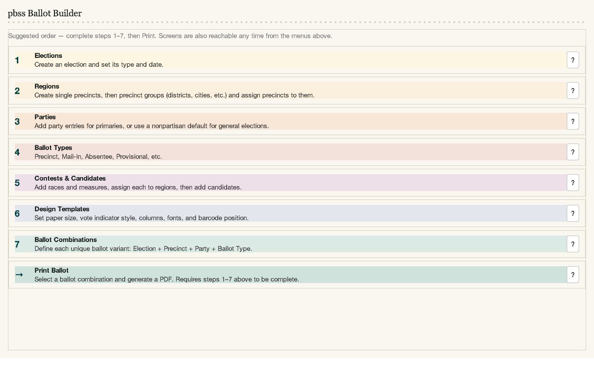
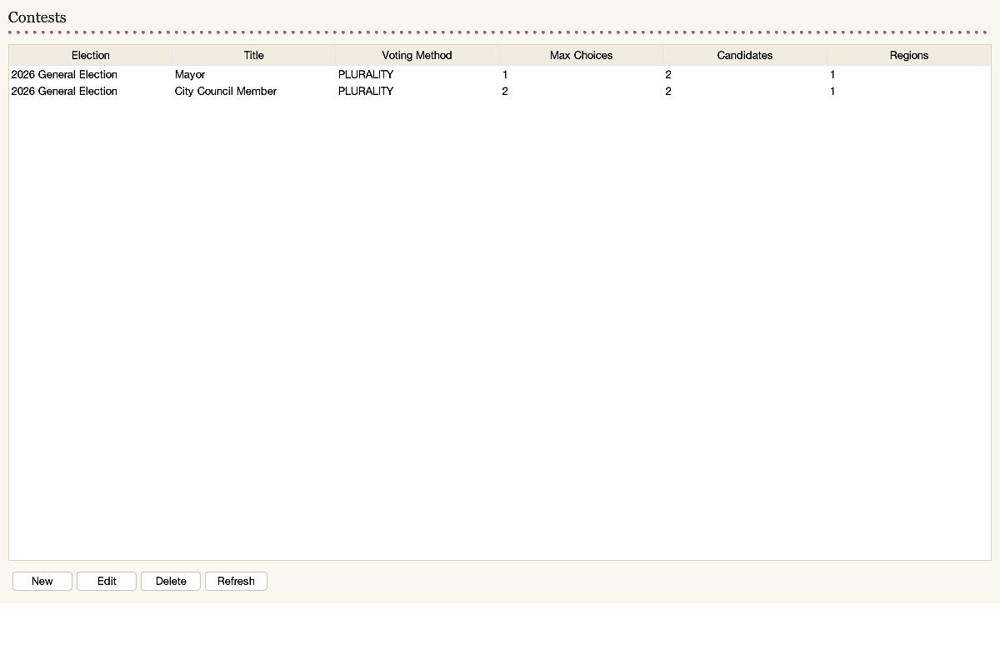
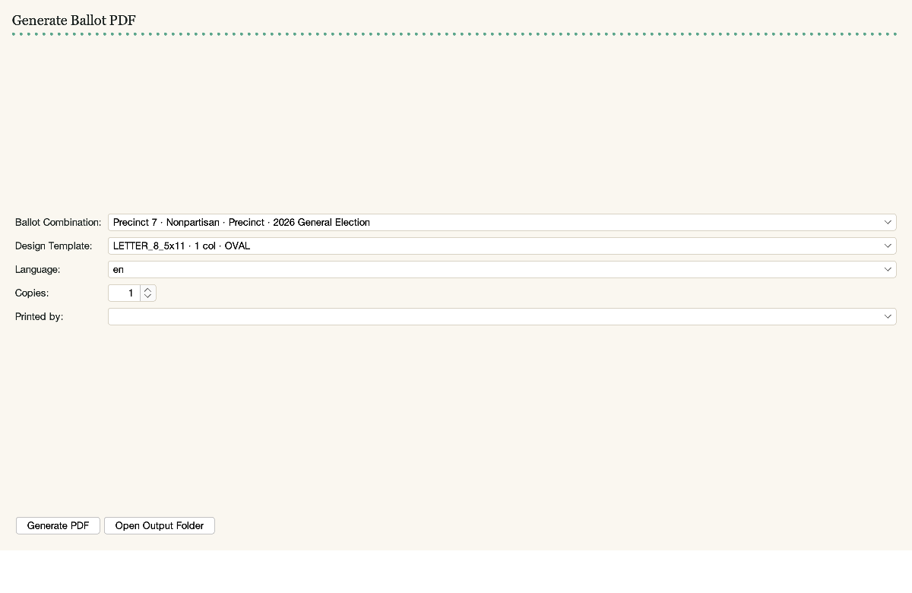
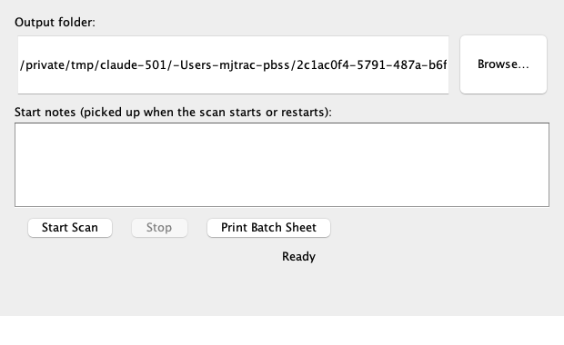
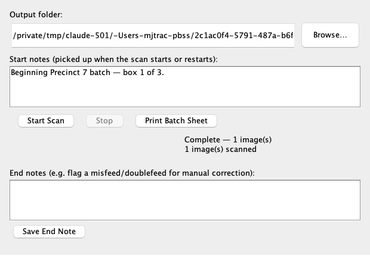
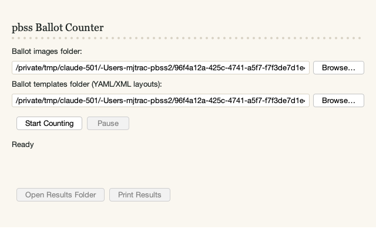
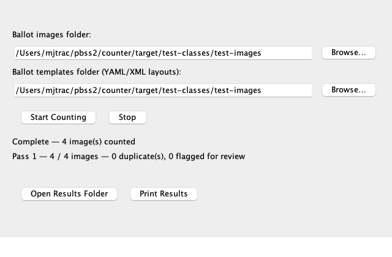
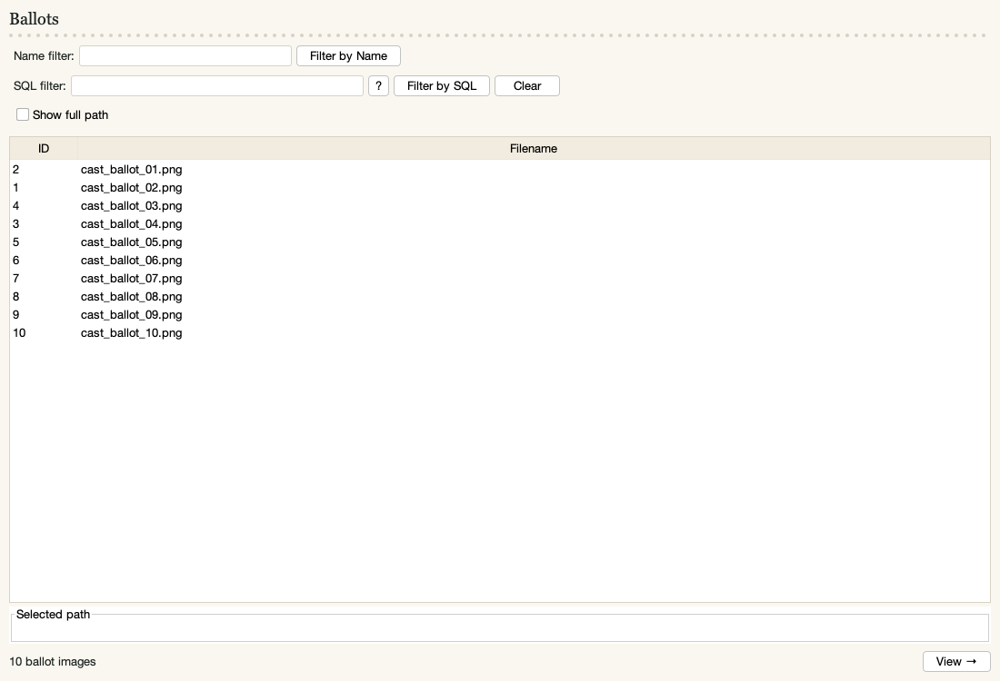
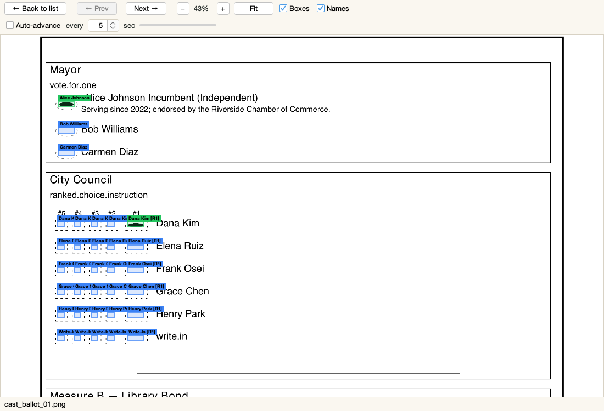
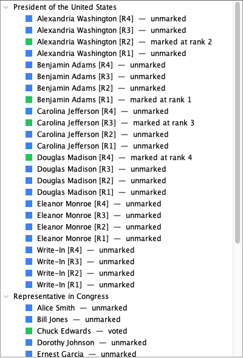

<!--
  Copyright (C) 2026 Mitch Trachtenberg
  Election Ballot System — licensed under the GNU General Public License v3.
  See <https://www.gnu.org/licenses/> for the full license text.
-->

# pbss Desktop User's Guide

A walkthrough of the four recommended desktop programs — **builder**,
**scanner**, **counter**, and **viewer** — in the order an election
actually uses them: design the ballot, scan it, count it, review it. See
the top-level [README.md](../README.md) for installation, building, and
configuration; this guide is about what each screen does once the program
is running.

All four are ordinary double-clickable desktop programs. None of them
need an internet connection — see
[Running Offline / Air-Gapped](../README.md#running-offline--air-gapped)
in the README.

## builder — design the election and the ballot

Launch `builder` and you land on the **Home** screen: a numbered checklist
of the setup steps, in the order the app expects them (though every screen
is also reachable any time from the **Setup** / **Ballots** / **Admin**
menus at the top).

Steps 1–4 (**Elections**, **Regions**, **Parties**, **Ballot Types**) are
simple CRUD screens — a table with **New** / **Edit** / **Delete** /
**Refresh** buttons, one row per record. **Contests & Candidates** (step
5) is the same idea with more depth: each contest also gets a candidate
list and a set of assigned regions, edited via their own dialogs.

Step 6 (**Design Templates**) is where you choose paper size, column
count, and vote-indicator style (oval, rectangle, or connect-the-dots —
see the README's [Vote Indicator Styles](../README.md#vote-indicator-styles)
table). Step 7 (**Ballot Combinations**) defines each unique ballot
variant as an Election + Precinct + Party + Ballot Type combination — a
jurisdiction with primaries and multiple precincts will have many of
these; a simple nonpartisan single-precinct election will have just one.

Once steps 1–7 are done, **Print** generates the actual ballot: pick a
combination, a design template, a language, and how many copies, then
**Generate PDF**. This writes both the printable PDF and the YAML layout
file `counter` will need later into the ballot templates folder —
**Open Output Folder** takes you straight there.

`builder` has no login of its own (the **Admin** menu still manages the
same `User` records `bBuilder`/`blBuilder` use, for when you're running
those alongside it) — see [builder/README.md](../builder/README.md) for
the full screen list and what's deliberately left out of the CRUD forms.

## scanner — turn paper into images

`scanner` drives a physical document scanner (NAPS2, `scanimage`, or a
custom shell command — see [scanner/README.md](../scanner/README.md)) and
deposits ballot images into the folder `counter` will read from. Sign in
with an `ADMINISTRATOR`- or `OPERATOR`-role account.

The **Output folder** field is pre-filled with the shared default
(`~/pbss_data/cast_ballot_scans` unless overridden — see the README's
[property-override section](../README.md#configuring-these-apps-property-overrides)).
**Start notes** is a free-text field for anything worth recording about
this batch before it begins (e.g. "Beginning Precinct 7 batch — box 1 of
3") — it's logged immediately with its own timestamp, not just folded
into the end-of-batch summary.

Click **Start Scan** and the scanner backend runs; a live progress line
shows images scanned and the last file written. **Stop** halts a batch in
progress. Once a batch finishes, an **End notes** field appears — for
flagging something noticed *after the fact* (a misfeed found while
reviewing the physical stack, say), tagged in the log against the batch
it refers to regardless of how much later it's written.

**Print Batch Sheet** sends the current start/end notes to a printer as a
physical page — meant to be inserted into the paper ballot stack at the
point it documents. If `scanner.notes.print-flag-pages=true` is set, the
same thing happens automatically whenever a note is saved, with no click
needed; either way, a printer problem is only ever logged, never allowed
to interrupt scanning.

## counter — count the votes

`counter` is deliberately the smallest of the four: two folders, Start,
Stop, and a results link — everything else (darkness threshold, DPI,
assumed paper width) is fixed in `application.properties` rather than
exposed as a control (see [counter/README.md](../counter/README.md)).
Sign in with a `COUNTER_OPERATOR`- or `ADMIN`-role account.

Both folder fields are pre-populated: **Ballot images folder** points at
where `scanner` (or a physical scanner configured directly) deposits
images; **Ballot templates folder** points at the YAML layout files
`builder`'s Print screen generated. Click **Start Counting** and it works
through the images — corner detection, QR decode, vote-indicator
sampling — updating a live pass/processed/duplicate/flagged-for-review
count as it goes.

A ballot that fails corner detection, has an unreadable QR code, or trips
the scribble-detection heuristic gets flagged for manual review rather
than silently miscounted — the screenshot above shows the normal
successful case (4 counted, 0 flagged) on a small test batch that
includes a deliberately messy-marks ballot and a deliberate overvote,
both counted correctly rather than rejected. **Open Results Folder**
opens `results_report.html` and its companion reports (RCV tabulation,
overvotes, write-ins, scribbles — see the README's
[bCounter report-files table](../README.md#bcounter)) in the OS file
browser; **Print Results** sends `results_report.html` straight to a
printer via the OS's own HTML print handling.

## viewer — review the scanned ballots

`viewer` is read-only — it never writes to `counter_results.db`, so it's
always safe to run alongside `counter`, even mid-scan, or on a separate
machine dedicated entirely to reviewing results (see the README's
[viewer-only station](../README.md#setting-up-a-viewer-only-station)
setup for a multi-station election). Sign in with a `VIEWER`- or
`ADMIN`-role account.

The ballot list is every scanned image, filterable by name/glob:

Double-click (or select and click **View →**) to open a ballot. Each
vote-indicator box is color-coded — green for a counted mark, blue for an
unmarked box, amber for an overvote — with candidate names labeled
directly on the image. **Next**/**Prev** step through the filtered list
without going back to it; **Fit**/**+**/**−** control zoom; hovering a
box shows its contest, candidate, and status in the status bar.

This is the same image-plus-overlay rendering blCounter's embedded Viewer
produces, but drawn directly with Java2D rather than a browser engine —
see [viewer/README.md](../viewer/README.md) for why that distinction
exists and what the standalone viewer deliberately leaves out (SQL
filtering, RCV/scribble reports, auto-advance review mode) compared to
blCounter's fuller-featured version.

**View → Contests & Candidates** (or Ctrl+L / Cmd+L) opens a second
window listing every contest on the ballot currently on screen — click a
contest to expand it into its candidates, each with a color swatch
matching its status (green voted, amber overvoted, blue unmarked). It's
the Swing equivalent of bCounter's embedded web Viewer's sidebar, as a
separate toggleable window rather than a fixed panel, so it doesn't
compete with the image for space. Clicking a candidate here highlights
its box on the ballot image, and clicking a box on the image highlights
the matching candidate here — same bidirectional highlighting the web
version does.

## Other versions

`bBuilder`/`bCounter`/`bScanner` (web) and `blBuilder`/`blCounter`/`blScanner`
(JavaFX) cover the same workflow with a browser or native-desktop UI
respectively — see the README's
[Other Versions Available](../README.md#other-versions-available) section.
